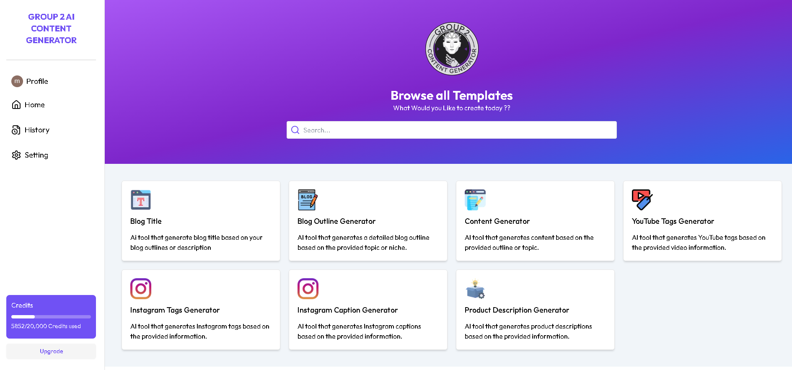

# AI Content Generator 

This project  is an AI Content Generation Dashboard that enables users to generate AI-powered content and track their generation history. It leverages the Google Gemini API for content creation, with user authentication handled via Clerk, and data stored in a NEON PostgreSQL database using Drizzle ORM.
## Tech Stack

- **Next.js**: A React framework for production.
- **Drizzle ORM**: A TypeScript ORM for PostgreSQL.
- **NEON PostgreSQL**: A serverless PostgreSQL database.
- **Tailwind CSS**: A utility-first CSS framework for styling.
- **TypeScript**: A superset of JavaScript with static types.
- **Clerk**: Authentication
- **Google Gemini API**: AI Integration
- **Radix UI (Icons and slots)**: UI Components

## Features

- **AI Content Generation**: Generate content using the Google Gemini API.
- **User Authentication**: Secure user authentication using Clerk.
- **Content History**: View the history of AI-generated content, filtered by the user's email.
- **Responsive Design**: Fully responsive design using Tailwind CSS.
- **Copy to Clipboard**: Easily copy AI-generated responses to the clipboard.

## Setup and Installation

### Prerequisites

- Node.js
- PostgreSQL

### Installation

1. **Clone the Repository**
    \`\`\`bash
    git clone https://github.com/BossJaybs/AI-GENERATOR
    cd ai-generator
    \`\`\`

2. **Install Dependencies**
    \`\`\`bash
    npm install
    \`\`\`

3. **Set Up Environment Variables**
    Create a \`.env.local\` file in the root directory and add the following environment variables:
    \`\`\`env
    NEXT_PUBLIC_DRIZZLE_DB_URL=your-neon-postgresql-url
    NEXT_PUBLIC_CLERK_PUBLISHABLE_KEY=your-clerk-publishable-key
    CLERK_SECRET_KEY=your-clerk-secret-key
    GOOGLE_GEMINI_API_KEY=your-google-gemini-api-key

    NEXT_PUBLIC_CLERK_SIGN_IN_URL=/sign-in
    NEXT_PUBLIC_CLERK_SIGN_UP_URL=/sign-up
    \`\`\`

4. **Run Database Migrations**
    \`\`\`bash
    npm run db:migrate
    \`\`\`

5. **Start the Development Server**
    \`\`\`bash
    npm run dev
    \`\`\`

6. **Visit the Application**
    Open your browser and go to \`http://localhost:3000\`.

## Folder Structure

- \`components/\`: React components used in the project.
- \`pages/\`: Next.js pages, including the history page.
- \`styles/\`: Global styles and Tailwind CSS configuration.
- \`utils/\`: Utility files, including database configuration and schema.

## Database Schema

The database schema is defined in \`utils/schema.tsx\`

